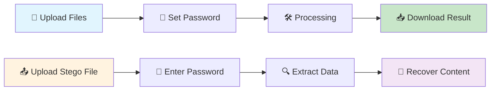

<div align="center">

# 🛡️ VeilForge
### *Advanced Steganography Platform*

**Hide your secrets in plain sight with cutting-edge steganography technology**


[](https://opensource.org/licenses/MIT)
[](https://reactjs.org/)
[](https://fastapi.tiangolo.com/)
[](https://www.typescriptlang.org/)

[🚀 **Try Live Demo**](https://veilforge-demo.vercel.app) • [📖 **Documentation**](./DEPLOYMENT_GUIDE.md) • [🐛 **Report Issues**](../../issues)

</div>

---

## 🌟 **What is VeilForge?**

VeilForge is a **state-of-the-art steganography platform** that allows you to securely hide sensitive data inside everyday digital files. Whether you're a cybersecurity professional, researcher, digital forensics investigator, or privacy advocate, VeilForge provides enterprise-grade data concealment capabilities through an intuitive web interface.

### ✨ **Key Capabilities**

🖼️ **Multi-Format Support** • Hide data in images, videos, audio files, and documents  
🔐 **Military-Grade Encryption** • AES-256-GCM encryption with password protection  
🕵️ **Forensic Mode** • Advanced embedding with tamper detection  
📦 **Batch Processing** • Process multiple files simultaneously  
🎯 **Real-Time Progress** • Live status updates and progress tracking  
🌐 **Modern Interface** • Responsive design with dark/light themes  
🔒 **Secure Processing** • Temporary file handling with automatic cleanup  
📊 **Operation History** • Track all steganography operations with database integration

---

## 🎯 **How It Works**

<div align="center">



</div>

### **Embedding Process**
1. **📁 Upload Carrier File** - Choose your cover file (image, video, audio, or document)
2. **📝 Select Content** - Type text or upload a file to hide
3. **🔐 Set Security** - Create a strong encryption password
4. **⚙️ Choose Method** - Select standard or forensic embedding mode
5. **🔄 Process** - VeilForge embeds your data invisibly
6. **💾 Download** - Get your steganographically enhanced file

### **Extraction Process**
1. **📤 Upload File** - Upload a file containing hidden data
2. **🔑 Enter Password** - Provide the decryption password
3. **🔍 Extract** - VeilForge recovers the hidden content
4. **💾 Download** - Retrieve your original hidden data

---

## 🧪 **Use Cases**

| **Sector** | **Application** | **Benefits** |
|------------|-----------------|--------------|
| **🔍 Digital Forensics** | Evidence metadata embedding | Tamper detection, chain of custody |
| **🔒 Secure Communication** | Covert message transmission | Undetectable communication channels |
| **©️ Copyright Protection** | Ownership watermarking | Proof of authorship, piracy prevention |
| **💾 Data Backup** | Key storage in media files | Distributed backup strategy |
| **🛡️ Privacy Protection** | Document concealment | Personal data protection |
| **🔬 Research** | Information hiding studies | Academic and commercial research |

---

## 🛠️ **Technology Stack**

<div align="center">

| **Component** | **Technology** | **Purpose** |
|---------------|----------------|-------------|
| **Frontend** | React 18 + TypeScript | Modern, responsive user interface |
| **Backend** | FastAPI + Python 3.11 | High-performance API server |
| **Database** | Supabase (PostgreSQL) | Operation tracking and user management |
| **Styling** | TailwindCSS + ShadCN/UI | Beautiful, accessible components |
| **Processing** | OpenCV, PIL, NumPy | Advanced steganography algorithms |
| **Security** | AES-256-GCM, PBKDF2 | Military-grade encryption |
| **Deployment** | Vercel + Render | Global CDN and scalable hosting |

</div>

---

## 📊 **Performance Specifications**

| **File Type** | **Max Size** | **Processing Time** | **Embedding Capacity** | **Security Level** |
|---------------|--------------|-------------------|---------------------|-------------------|
| **🖼️ Images** | 50 MB | 2-5 seconds | ~12.5% of carrier | High |
| **🎵 Audio** | 100 MB | 5-10 seconds | ~6.25% of carrier | Very High |
| **🎬 Video** | 500 MB | 15-30 seconds | ~3.125% of carrier | Excellent |
| **📄 Documents** | 25 MB | 1-3 seconds | ~25% of carrier | High |

**Supported Formats:**
- **Images**: PNG, JPEG, BMP, TIFF, GIF
- **Audio**: WAV, MP3, FLAC, OGG, AAC
- **Video**: MP4, AVI, MOV, WMV, MKV  
- **Documents**: PDF, DOCX, TXT, RTF

---

## 🚀 **Quick Start**

### **🌐 Try Online (Recommended)**

Visit our live demo: **[VeilForge Demo](https://veilforge-demo.vercel.app)**

No installation required! Experience all features instantly in your browser.

### **💻 Local Development**

#### Prerequisites
- **Node.js** 18+ and npm
- **Python** 3.11+ and pip
- **Git** for version control

#### **1️⃣ Clone Repository**
```bash
git clone https://github.com/srushti2026/VeilForge-Steganogaphy_Platform.git
cd VeilForge-Steganogaphy_Platform
```

#### **2️⃣ Setup Backend**
```bash
cd backend
pip install -r requirements.txt
python app.py
```
*Backend runs on `http://localhost:8000`*

#### **3️⃣ Setup Frontend** 
```bash
cd frontend
npm install
npm run dev
```
*Frontend runs on `http://localhost:5173`*

#### **4️⃣ Access Application**
- **Frontend**: http://localhost:5173
- **Backend API**: http://localhost:8000
- **API Documentation**: http://localhost:8000/docs

---

## 🏗️ **Project Structure**

```
VeilForge/
├── 🌐 frontend/                 # React Frontend Application
│   ├── src/
│   │   ├── components/          # Reusable UI components
│   │   ├── pages/              # Main application pages
│   │   ├── services/           # API integration services
│   │   └── utils/              # Utility functions
│   ├── public/                 # Static assets
│   ├── package.json            # Node.js dependencies
│   └── vercel.json            # Vercel deployment config
│
├── 🔧 backend/                  # FastAPI Backend Application
│   ├── app.py                  # Main FastAPI application
│   ├── modules/                # Steganography processing modules
│   ├── requirements.txt        # Python dependencies
│   └── render.yaml            # Render deployment config
│
├── 📚 docs/                     # Documentation and guides
├── 🚀 DEPLOYMENT_GUIDE.md      # Deployment instructions
├── 📝 MIGRATION_STATUS.md      # Migration completion status
└── 📄 README.md                # This file
```

---

## 🔐 **Security Features**

### **🛡️ Encryption & Protection**
- **AES-256-GCM Encryption**: Military-grade security standard
- **PBKDF2 Key Derivation**: 100,000+ iterations for password hashing
- **HMAC-SHA256**: Message authentication codes for integrity
- **Digital Signatures**: Authenticity verification

### **🕵️ Steganography Techniques**
- **LSB (Least Significant Bit)**: Undetectable pixel manipulation
- **Frequency Domain**: DCT and DWT coefficient embedding
- **Metadata Preservation**: Maintain file authenticity
- **Adaptive Embedding**: Content-aware data placement

### **🔒 Privacy & Safety**
- **No Data Logging**: Files processed without permanent storage
- **Secure Upload**: Temporary file handling with automatic cleanup
- **Input Validation**: Comprehensive sanitization and validation
- **HTTPS Encryption**: End-to-end secure communication

---

## 🚀 **Deployment Guide**

VeilForge is deployment-ready for production environments:

### **Backend → Render**
```bash
# Automated deployment using render.yaml
git push origin main
# Render automatically detects and deploys backend
```

### **Frontend → Vercel**
```bash
# Automated deployment using vercel.json  
git push origin main
# Vercel automatically detects and deploys frontend
```

**📖 Complete deployment instructions: [DEPLOYMENT_GUIDE.md](./DEPLOYMENT_GUIDE.md)**

---

## 🤝 **Contributing**

We welcome contributions from developers, researchers, and security professionals!

### **🚀 Quick Contribution Steps**
1. **🍴 Fork** the repository
2. **🌿 Create** a feature branch: `git checkout -b feature/amazing-feature`
3. **💾 Commit** changes: `git commit -m 'Add amazing feature'`
4. **📤 Push** to branch: `git push origin feature/amazing-feature`
5. **🔄 Open** a Pull Request

### **🎯 Contribution Areas**
- **🐛 Bug Fixes**: Help improve stability and performance
- **✨ New Features**: Implement advanced steganography algorithms
- **📚 Documentation**: Enhance guides and tutorials
- **🔍 Testing**: Add comprehensive test coverage
- **🎨 UI/UX**: Improve user interface and experience
- **🔒 Security**: Enhance security measures and protocols

### **📋 Development Guidelines**
- Follow existing code style and conventions
- Add tests for new features
- Update documentation for changes
- Ensure all tests pass before submitting

---

## 🛡️ **Legal & Responsible Use**

### **✅ Legitimate Applications**
- **🔍 Digital forensics and investigation**
- **🔬 Academic research and education**
- **🛡️ Privacy protection and secure communication**
- **©️ Copyright protection and watermarking**
- **🔒 Data backup and recovery systems**

### **⚠️ Important Notice**
This software is designed for **legitimate, legal, and ethical purposes only**. Users must:
- Comply with local, national, and international laws
- Respect intellectual property rights
- Obtain proper authorization before processing others' data
- Use the technology responsibly and ethically

---

## 📞 **Support & Resources**

### **📚 Documentation**
- **🚀 Deployment Guide**: [DEPLOYMENT_GUIDE.md](./DEPLOYMENT_GUIDE.md)
- **🔄 Migration Status**: [MIGRATION_STATUS.md](./MIGRATION_STATUS.md)
- **🧹 Cleanup Summary**: [CLEANUP_SUMMARY.md](./CLEANUP_SUMMARY.md)

### **🆘 Get Help**
- **🐛 Bug Reports**: [Create an Issue](../../issues/new?template=bug_report.md)
- **💡 Feature Requests**: [Request Feature](../../issues/new?template=feature_request.md)
- **💬 Discussions**: [GitHub Discussions](../../discussions)
- **📧 Contact**: Open an issue for direct communication

### **🤝 Community**
- **👥 Contributors**: [View Contributors](../../graphs/contributors)
- **⭐ Stargazers**: [View Stargazers](../../stargazers)
- **🔄 Forks**: [View Network](../../network)

---

## 📄 **License**

This project is licensed under the **MIT License** - see the [LICENSE](LICENSE) file for full details.

```
MIT License - Free for personal, educational, and commercial use
Copyright (c) 2024 VeilForge Development Team
```

---

## 🙏 **Acknowledgments**

VeilForge is built upon the foundation of exceptional open-source technologies:

- **React Team** for the amazing frontend framework
- **FastAPI** for the high-performance Python web framework  
- **Supabase** for the powerful backend-as-a-service platform
- **OpenCV Community** for computer vision capabilities
- **Vercel & Render** for seamless deployment platforms
- **Steganography Research Community** for decades of academic contributions

---

<div align="center">

### **🚀 Ready to Start Hiding Data Securely?**

**[🌍 Try VeilForge Live](https://veilforge-demo.vercel.app)** • **[⭐ Star this Repository](../../stargazers)** • **[🔄 Fork & Contribute](../../fork)**

---

**Made with ❤️ for Privacy, Security & Digital Freedom**

*Empowering secure communication through advanced steganography*


</div>