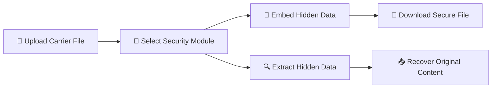

<div align="center">


# 🛡️ VeilForge

### Secure Steganography & Digital Watermarking Platform

<p>
Hide sensitive information securely inside digital media using advanced steganography,
encryption, copyright watermarking, and forensic metadata embedding.
</p>

<br>


<br>


</div>

---

# 🌟 Overview

VeilForge is a full-stack steganography platform developed to provide secure and invisible data protection through modern cryptographic and steganographic techniques.

The platform enables users to hide and extract confidential information from images, audio, video, and document files while preserving the original appearance of the carrier media.

In addition to traditional steganography, VeilForge includes specialized modules for copyright watermarking, forensic metadata embedding, and AI-assisted image generation workflows.

---

# ✨ Core Features

### 🔐 Secure Data Protection

* Password-protected data embedding
* Encrypted hidden content
* Secure extraction workflow

### 🖼️ Multi-Format Support

* Images
* Audio Files
* Video Files
* Documents

### 🛡️ Specialized Security Modules

* General Steganography
* Copyright Watermarking
* Forensic Metadata Embedding
* PixelVault AI Integration

### ⚡ User Experience

* Modern responsive interface
* Real-time progress tracking
* Intuitive workflow
* Interactive dashboard

---

# 📸 Project Preview

## 🏠 Landing Page

<p align="center">
  
</p>

---

## 🔐 General Protection Module

<p align="center">
  
</p>

---

## 🏗️ System Architecture

<p align="center">
  
</p>

---

# ⚙️ Technology Stack

<table align="center">
<tr>
<td align="center">

### 🎨 Frontend

React.js

TypeScript

Tailwind CSS

ShadCN UI

</td>

<td align="center">

### ⚡ Backend

FastAPI

Python

REST APIs

</td>

</tr>

<tr>

<td align="center">

### 🗄️ Database

Supabase

PostgreSQL

</td>

<td align="center">

### 🔬 Processing

OpenCV

NumPy

Pillow (PIL)

</td>

</tr>

</table>

---

# 🔄 System Workflow


```mermaid
flowchart LR

A[📂 Upload Carrier File]
--> B[🔐 Select Security Module]

B --> C[📝 Embed Hidden Data]
B --> D[🔍 Extract Hidden Data]

C --> E[💾 Download Secure File]
D --> F[📤 Recover Original Content]
```

---

# 🏗️ Architecture Overview

The platform follows a modular architecture consisting of:

### 🌐 Frontend Layer

* React.js
* TypeScript
* Responsive UI

### ⚡ Backend Layer

* FastAPI Services
* Processing Engine
* Security Modules

### 🛡️ Core Processing Layer

* Steganography Engine
* Watermarking Engine
* Forensic Metadata Engine

### 🗄️ Storage Layer

* Supabase Database
* Metadata Management
* User Activity Records

---

# 🚀 Getting Started

## Clone Repository

```bash
git clone https://github.com/srushti2026/Crypto-Steganography.git
```

```bash
cd Crypto-Steganography
```

---

## Backend Setup

```bash
cd backend

pip install -r requirements.txt

python app.py
```

Backend will run on:

```text
http://localhost:8000
```

---

## Frontend Setup

```bash
cd frontend

npm install

npm run dev
```

Frontend will run on:

```text
http://localhost:5173
```

---

# 📂 Project Structure

```text
Crypto-Steganography
│
├── frontend
│   ├── components
│   ├── pages
│   ├── services
│   └── assets
│
├── backend
│   ├── modules
│   ├── app.py
│   └── requirements.txt
│
├── Preview Images
│   ├── LOGO.png
│   ├── webpage.JPG
│   ├── preview.JPG
│   └── df0.png
│
└── README.md
```

---

# 🔮 Future Enhancements

* AI-powered steganalysis detection
* Advanced forensic reporting
* Additional embedding algorithms
* Cloud-based secure storage
* Multi-user collaboration features

---

# 👩‍💻 Developed By

### Srushti Kumar

Computer Science & Design Engineer

Data Science & Analytics Enthusiast

Passionate about Cybersecurity, AI, Data Analytics, and Full-Stack Development.

---

<div align="center">

### ⭐ If you found this project interesting, consider giving it a star!


**Built with 💙 using React, FastAPI, Python & Supabase**

</div>
